## SmartScan Azure 🚀

Serverlessowa platforma do inteligentnej analizy i archiwizacji dokumentów.

```mermaid
graph LR
A[Użytkownik] -->|Przesyła plik| B(React Frontend)
B -->|Zapisuje plik| C{Azure Blob Storage}
C -->|Trigger: Nowy plik| D[Azure Function]
D -->|Analiza obrazu/tekstu| E[Azure AI Services]
E -->|Zwraca metadane/tekst| D
D -->|Zapisuje wynik| F[(Azure Cosmos DB)]
F -->|Pobranie wyników| B
```

### 📝 O projekcie

SmartScan Azure to aplikacja typu "Cloud-Native", która automatyzuje proces wyciągania informacji z obrazów i dokumentów (OCR). System działa w architekturze sterowanej zdarzeniami (Event-Driven Architecture), co zapewnia mu niemal nieograniczoną skalowalność przy minimalnych kosztach utrzymania.

##### Główne funkcjonalności:

Automatyczna analiza: System rozpoznaje tekst i obiekty na zdjęciach natychmiast po ich przesłaniu.

Przetwarzanie Serverless: Skalowanie do zera, gdy aplikacja nie jest używana.

Bezpieczeństwo: Wykorzystanie Managed Identity zamiast haseł w kodzie.

### 🏗️ Architektura systemu

Aplikacja została zbudowana w oparciu o ekosystem Microsoft Azure:

Frontend: React.js hostowany na Azure Static Web Apps.

Storage: Azure Blob Storage (przechowywanie plików źródłowych).

Compute: Azure Functions (logika biznesowa wyzwalana zdarzeniami).

AI/ML: Azure AI Services (Computer Vision / Document Intelligence).

Database: Azure Cosmos DB (NoSQL - przechowywanie wyników analizy).

Security: Azure Key Vault & Managed Identity.

🛠️ Technologie
🚀 Jak uruchomić projekt?
(Sekcja do uzupełnienia w miarę postępów)

Sklonuj repozytorium.

Skonfiguruj infrastrukturę za pomocą plików Bicep/Terraform w folderze /infra.

Dodaj zmienne środowiskowe do Azure Function.

npm install w folderze /frontend.

📈 Czego się nauczyłem?
Integracji usług chmurowych w modelu Event-Driven.

Zarządzania dostępem za pomocą RBAC (Role-Based Access Control).

Pracy z nieustrukturyzowanymi danymi w Cosmos DB.
